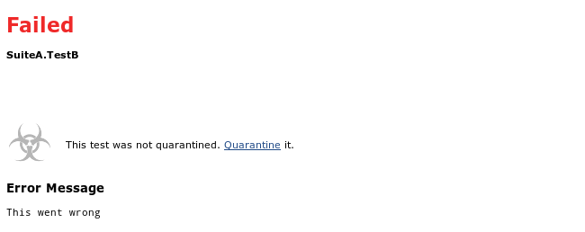
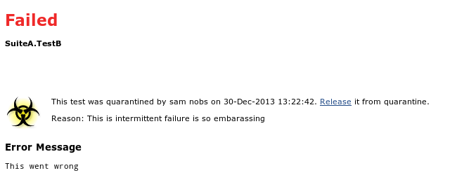
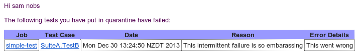
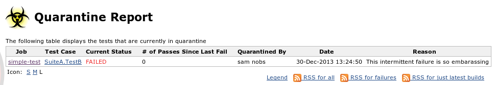

Jenkins Quarantine Plugin
=========================

*Work in progress - use at your own peril*

A plugin for Jenkins CI that allows users to quarantine flakey tests cases.

A quarantined test case will not make the job fail if the test case fails. It will still appear as a failure in the test results, but it is ignored in the final pass/fail decision. The person who put the test case in quarantine will receive an email about each failure - by quarantining a test case they take responsibility to ensure the test case eventually stabilises. Quarantining only works on individual test cases and not on complete jobs. Currently, the job needs to use the junit XML format (which most our unit tests and integration tests do) in order to be eligible for test quarantine.

Preparing a Job
---------------

Before quarantining is available for the test cases in a job, you have to add *Publish quarantinable JUnit test result report* to your post-build actions. If you were using the previously existing *Publish JUnit test result report*, make sure you delete it and use the quarantinable one instead. Also, ensure the checkbox to allow quarantining is checked:

The quarantining option is not going to be available immediately after this configuration change. The job must have run at least once so all the report entries are updated to have the required quarantine property.

Quarantining a Test Case
------------------------

To quarantine a test case, navigate to its result report page. If the job has been configured as described above and it has run at least once since the configuration change, the report page will tell you that the test case has not been quarantined, but that you can quarantine it by clicking the link:

After quarantining it, optionally giving a reason for doing so (recommended!), the page looks like this:

A test case can be quarantined in a failing or passing state, as long as you activate quarantine on the latest result. If you try to do so on an older result, it may not work at all (if quarantining has not been enabled in the configuration at the time the test ran), or it will tell you to navigate to the latest result.

Let's assume we have quarantined TestB in SuiteA. If the test fails, we'll see the following in jenkins' console output:
Recording test results:
 
    [Quarantine]: sent email to samuel.nobs@xxxxxxx.com
    [Quarantine]: SuiteA.TestB failed but is quarantined
    [Quarantine]: 0 unquarantined failures remaining
    Finished: SUCCESS
 
So, even though the test failed, the overall result is still a pass. However, because I quarantined the test, I will get notified about its failure with an email along the lines of:

If there is another failure in a test that has not been put in quarantine, the job will still fail.

Quarantine Report
-----------------

A list of quarantined tests is available in the top level *Quarantine Report*:

Shortcomings
------------

Piggybacking this functionality on the regular JUnit test report seems weird as I basically clone-and-own part of this built-in plugin, and it makes configuration a bit counter-intuitive. I can't do it in a separate post-build step as you are only allowed to make the build status worse in a step - you can't move it from UNSTABLE to SUCCESS, for instance. Ideally, I would need an extension point that allows to filter results before they get published.

Also, this would make this whole approach less coupled to JUnit test reports, making it available to other test report publishers.

Disabled the maven test injection `<maven-hpi-plugin.disabledTestInjection>true</maven-hpi-plugin.disabledTestInjection>`

Notes
-----

Compatible with org.jenkins-ci.plugins 3.19 and to be used as a pipeline step.
